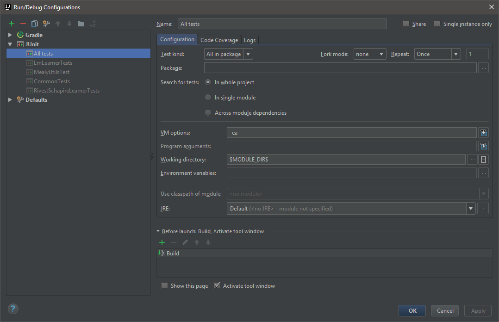
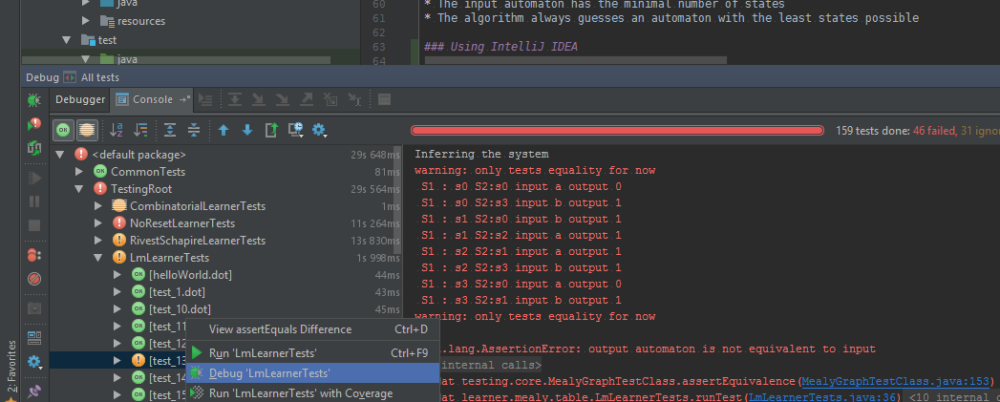
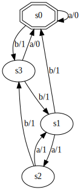
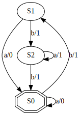
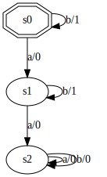
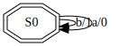
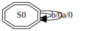
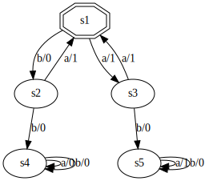

# Testing report

## Testing philosophy

We focused on testing the algorithms implemented by the SIMPA toolkit in a clear, versatile and efficient way. In that
matter, we are not doing system-wide tests of the toolkit, as testing command-line interfaces is of little interest and
a very slow and tedious process.

This means we are actually doing gray-box testing. Source code in the `src/main/java/hit` folder hasn't been changed
excepted for the changes mentioned below. Our test cases (`src/test/java`) are instead compiled as part of
the `gradle check` task, which means they can inherit learner algorithms in order to introspect data. Directly
extracting inferred automatons from the learner classes is also way more efficient than re-parsing the dot file from the
file system, and doesn't reduce the value of the test.

Our main objective is reusability: test cases for an algorithm should be reusable for another algorithm without any
changes outside of the class name of the Learner algorithm. As said before, our testing architecture is also focused on
speed, because a fast test suite is useful in finding and fixing bugs ([F.I.R.S.T Principles of Unit Testing](https://github.com/ghsukumar/SFDC_Best_Practices/wiki/F.I.R.S.T-Principles-of-Unit-Testing)).

## Code changes

* Added package name in the Antlr4 grammar
* Removed calls to `exportToDot` when creating conjectures

## Testing code architecture

### Overview

```
data/test:
    common  # Files for common test cases (see below)
    dot     # Valid dot files for algorithm validation
    utils   # Dot files for testing the utils class (see below)

src/test/java:
    common/CommonTests                   # Test common features in the project
    learner/mealy/[alg]/[alg]Tests       # Testing class for current algorithm [alg]
    learner/mealy/[alg]/[alg]WithOutput  # Subclassed learner that can output its last conjecture
    learner/mealy/TestingRoot            # Root class for specifying JUnit runners for classes
    testing/core/DotDriverBasedTestClass # Base class for test cases that use a Mealy driver based on dot files
    testing/core/MealyGraphTestClass     # Base class for test cases that test propreties of Mealy automata
    testing/core/MealyUtils              # Utils for testing properties of Mealy automata
    testing/self/MealyUtilsTest          # Test class for the above utils class
```

### Precisions

Classes for algorithm testing are not *standard* JUnit test classes, because we don't know the test plan until runtime.
Instead, they use the `Suite` runner, which can run `Parameterized` test class instances from the collection returned by
the `public static Collection<Object[]> suite()` method implemented by target classes. This method usually calls the
`buildSuite` base class methods that lists the files contained in the `data/test/dot` folder.

Actual testing code (apart from automaton loading) is defined in the methods decored with the `@Test` attribute, as
usual.

### Automaton equivalence testing

In order for our tests to be automated (ie. to execute and verify their output), we needed a way to check the
equivalence of the inferred automaton. Here we are considering generic Mealy automatons, on which traditional
equivalence algorithms cannot be applied, because they rely on minimization, a process only clearly defined for
language-matching automata, ie. with final states.

**WIP**: For now, we only check the equality of the input and output automatons. This is a valid decision under the
assumptions:

* The input automaton has the minimal number of states
* The algorithm always guesses an automaton with the least states possible

### Using IntelliJ IDEA

We advise using IntelliJ IDEA in order to run the tests (using the integrated test runner is faster than the one used
by gradle), but this also allows re-executing failed tests. In order to do so, create the following run configuration:



Then, once you have run the test, you can chose which case you would like to execute again, or even run in the debugger:



*Note: we assume here the project has been properly imported through the **Import project** feature, and picking the
gradle build file.* 


## Bugs found

The following bugs have been found as part of our testing of the learning algorithms. They have not been fixed in order
for the project maintainers to choose what best suits them, but we have included suggested fixes when possible.

### Mealy.importFromDot crashes without a title

* Java test: `common.CommonTests.noTitle`
* Dot test: `data/test/common/noTitle.dot`
* Method: `Mealy.importFromDot`

#### Expected behavior

Creating a graph from a dot file that does not specify a title should create a graph without a title attribute set. If
absolutely needed, the graph title should be inferred from the file name.

#### Actual behavior

A `java.lang.NullPointerException` is thrown.

#### Suggested fix

Change the grammar to make the title mandatory, or add a check for null title and throw a specialized exception.

### createConjecture exports a dot file every time

* Java test: all learner tests
* Dot test: all dot tests
* Method: any learner, sometimes `createConjecture`, sometimes a call to
`exportToDot`

#### Expected behavior

Only the resulting conjecture should be exported to dot.

#### Actual behavior

`exportToDot` is called on every computed conjecture, therefore slowing down computing and testing.

#### Suggested fix

* Add an option to disable export on every computed conjecture.
* Make exporting consistent (inside or outside of `createConjecture` methods)
* Do not overwrite previous exports

#### Applied fix

Disabled the exportToDot method.


### LmLearnerTests

----
### Error #1
#### Test
/data/test/dot/test_13.dot

| Expected | Infered |
| -------- | ------- |
|  |  |

#### Comments 
* fsm without DS or UIOs
* fsm has a W-set
* infered fsm

----
### Error #2
#### Test 
/data/test/dot/test_16.dot

| Expected | Infered |
| -------- | ------- |
|  |  |

#### Comments 
* AssertionError
* possibly related with errors #3 #4 #5

#### /data/test/dot/test_16.dot


----
### Error #3
#### Test
/data/test/dot/test_17.dot

| Expected | Infered |
| -------- | ------- |
|  |  |

#### Comments
* AssertionError
* possibly related with errors #3 #4 #5

----
### Error #4
#### Test
/data/test/dot/test_18.dot

| Expected | Infered |
| -------- | ------- |
|  |  |

#### Comments
* AssertionError
* possibly related with errors #3 #4 #5

----
### Error #5
#### Test
/data/test/dot/test_26.dot

| Expected | Infered |
| -------- | ------- |
|  |  |

#### Comments
* AssertionError
* possibly related with errors #3 #4 #5

